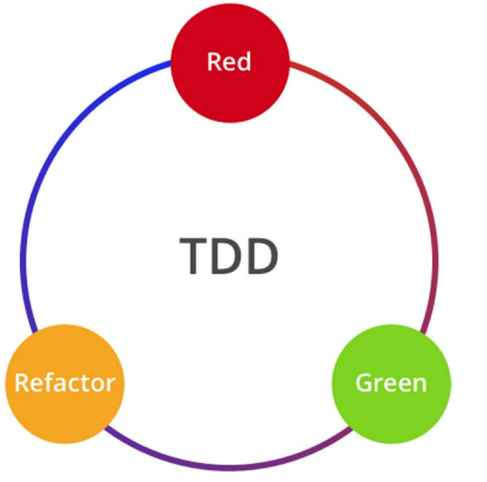

# TDD With React

## 1. Introduction to Test-Driven Development

TDD is a programming paradigm where tests are written to drive the development of the application.

It is mainly aimed at writing clean code that works.

## The Red-Green-Refactor Principle

This principle is a practical approach on how to implement TDD.

The diagram illustrates the three principles of TDD:

1. Write a test and see it fail.
2. Write just enough code to make the test pass.
3. Refactor the code if any code smells are detected.

This principle is easy to follow at first but the downside with it is that it does not help a beginner understand how to get started writing tests.

## Types of TDD.
TDD is a mixed concept with different variations and approaches.
1. Unit Test Driven-Development(UTDD)
2. Behavior-Driven Development (BDD)
3. Acceptance Test-Driven Development(ATDD)

### ATDD
ATDD describes the behavior of a software from a user's point of view by focusing on the business value of the application and not the implementation details.

ATDD AND UTDD can always be combined in one diagram as indicated below.

The diagram above describes the following steps followed during ATDD:
1. Write an acceptance test and see it fail.
2. Write a unit test and see it fail.
3. Write code to make the unit test pass.
4. Refactor the code.
5. Repeat steps 2 - 4 unit all the acceptance tests passes.

### BDD

Behavior-Driven Development is an agile practice that encourages collaboration among
different roles, developers, quality engineers, business analysts, or even other interested
parties in a software project.

Although BDD is to some extent a general idea about how software development
should be managed by both business interests and technical insight, the practice of BDD
involves some specialized tools. For example, domain-specific language (DSL) is used to
write tests in natural language that can be easily understood by nontechnical people and
can be interpreted by code and executed behind the scenes.

## Prerequisites of TDD

One major prerequisite for a developer who is getting into TDD is the ability to detect code smells and how to refactor them into a good design.

## 2. Getting Started with Jest.

Jest is a javascript testing framework from Facebook and is mainly used for writing Unit tests while allowing developers to write reliable and fast running tests.

### Setting up environment for Jest.

1. Install NodeJS  `npm install node`
2. Install and Configure Jest `npm install jest --save-dev`. You can also install Jest globally using: `npm install jest -g`

After creating a React project, initialize Jest to create the jest.config.js file which highlights some of the  most important configurations using `npx jest --init`

To run jest tests, you can either use `npx jest` or `npm test` on your terminal.

### Basic Concepts of Jest
We use **describe** to define a test block.

#### Example

`describe('calculator', () => {
    it('adds 2 and 3 to get 5', () =>{} )
    it('subtract 2 from 3 to get 1', () =>{} )
    it('divide 6 by 3 to get 2', () =>{} )
    it('multiply 2 by 3 to get 6', () =>{} )
)`

